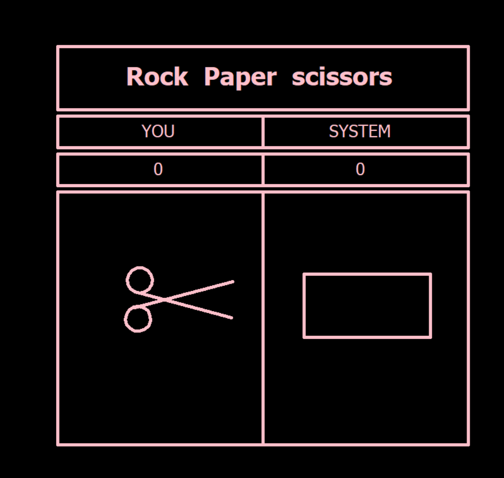

# Rock Paper Scissors Game

A graphical Rock Paper Scissors game built with Python and Turtle.

The user plays against the system, and the program randomly generates the system's choice. The game keeps track of the number of wins for both the user and the system.

## Features

- Graphical user interface using Turtle
- User input for Rock, Paper, and Scissors
- Random system choice generation
- Display user and system choices visually
- Track user win count
- Track system win count

## Technologies Used

- Python
- Turtle
- Random

## Screenshot

